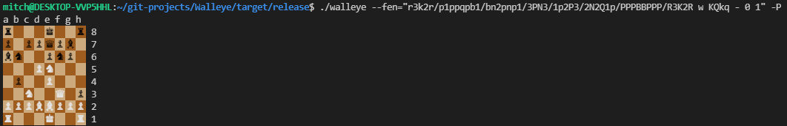

# Walleye


<p align="center">
  
</p>

[Walleye](https://en.wikipedia.org/wiki/Walleye) is a UCI-compatible chess engine written using the classic alpha-beta style AI.

## Example Usage

By default, the engine launches in UCI mode and expects to be loaded into a chess GUI. \
However, you can run some commands from the terminal, such as `-P` to watch the engine play against itself or `-T` to benchmark move generation and evaluation. 


```sh
# helpful when profiling, will accept a FEN string
./walleye -T --depth=5
```

```bash
# start a game from a FEN string and have the engine play against itself
./walleye --fen="r3k2r/p1ppqpb1/bn2pnp1/3PN3/1p2P3/2N2Q1p/PPPBBPPP/R3K2R w KQkq - 0 1" -P
```



Use `./walleye --help` for a complete list of commands.

## Play Against It

The engine should work in any chess program that supports UCI, at this time however it has only been tested with [Cute Chess](https://cutechess.com/). 

## Building

It is strongly recommended you compile the engine with `--release` for the best performance.

```
cargo build --release
```

### Portability

In the [cargo/config](./.cargo/config) file the target CPU is set to `native`. During testing I saw modest performance improvements using this setting. If however you plan to compile Walleye and use the binary on multiple systems you should delete these lines before compiling.

## About

### Board
- Square Centric 12x12 Array

Extra board squares are sentinel squares to make boundary checking easier.

### Search
- Alpha-Beta Pruning
- Iterative Deepening
- Capture Extension
- Killer Moves
- MVV-LVA
- PV Search

### Evaluation
- Piece Square Table

### Other
- Terminal based games with unicode chess boards
- Robust logging

## Tests

Walleye comes with a suite of unit tests and [perft tests](https://www.chessprogramming.org/Perft_Results). 
It has been verified on a variety of positions to around depth 5.

```sh
# run perft tests
cargo test perft
```

```sh
# run all tests
cargo test
```

## Resources

Some resources and tools I found helpful when creating this engine.

- [Chess Programming Wiki](https://www.chessprogramming.org)
- [UCI Protocol Spec](https://backscattering.de/chess/uci/)
- [FEN String Generator](http://www.netreal.de/Forsyth-Edwards-Notation/index.php)

## Issues

If you find an issue with the engine please include the `walleye_{PID}.log` file along with the report, you can enable this by setting `DebugLogLevel` to `Info` in the UCI options.

## License

Walleye is under the [MIT license](./LICENSE).
