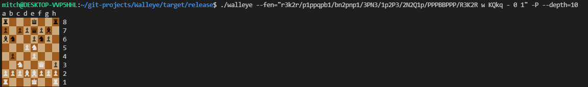

# Walleye

Walleye is a chess engine written completely in rust.

Walleye is a UCI compatible engine written using the classical alpha-beta style AI. It supports loading board positions from arbitrary FEN strings, unicode pretty printing to the console and UCI communication logs to help with debugging.

Originally this project was meant as a first introduction to rust and chess programming, but it got a bit carried away.

## Example Usage

By default the engine launches in UCI mode and expects to be loaded into a chess GUI. However you can also run some commands from the terminal, such as `-P` to watch the engine play against itself.

Type `./walleye --help` for a complete list of commands.

## Play Against It

The engine should be able to be loaded into any chess gui that supports UCI, at this time though it has only been tested with [Cute Chess](https://cutechess.com/). It is recommend you compile the engine with the `--release` option for the best performance.

## Resources

Some resources I found helpful when creating this engine

- https://www.chessprogramming.org
- https://backscattering.de/chess/uci/
- http://www.netreal.de/Forsyth-Edwards-Notation/index.php

## License

Walleye is under the MIT license.
